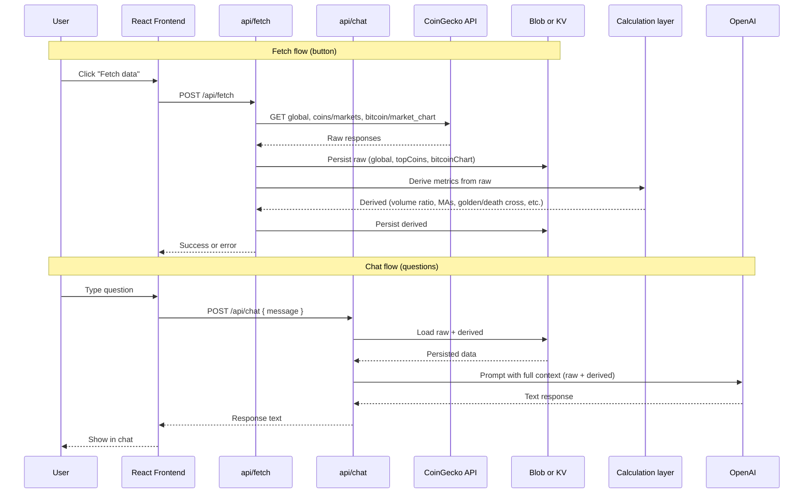

# Conversational Crypto Dashboard (POC)

**Overview:** POC with two flows—(1) One button fetches from all three CoinGecko sources, persists raw data, runs a calculation layer for derived metrics, and persists those too; (2) Chat uses only this persisted data as LLM context; no live API at query time. Storage (Blob or KV) required from day one. The **bulk of the app** (fetch button + chat window) lives at a route like **/cryptochat**; the root path (/) and other pages can be public and accessible by anyone. LLM responds with text only for ASAP POC. Tests as you go.

---

## Architecture

Two separate flows: **fetch** (on-demand, button-triggered) and **chat** (always uses persisted data).

- **Fetch**: One button calls `POST /api/fetch`. Backend fetches all three CoinGecko endpoints, persists raw JSON to storage, runs the calculation layer (pure functions on raw data), persists derived metrics to storage. No LLM involved.
- **Storage**: Required from the start. Vercel Blob or KV holds: raw (global, topCoins, bitcoinChart) and derived (volume ratio, BTC dominance, 50/200 MA, golden/death cross, market breadth, etc.). Chat always reads from here—no live CoinGecko calls when answering.
- **Chat**: Typical chat UI. Each message goes to `POST /api/chat`. Backend loads all persisted data (raw + derived), injects it into the LLM system/user prompt as context, returns the model's text reply. All questions are answered from this single snapshot.
- **POC scope**: Get this running ASAP. UI = fetch button + chat window. LLM responses are **text only** for now; whether the LLM later drives tables/charts (e.g. by returning structured data for the frontend to render) is left open—can add once the base flow works.
- **Routing**: Root (/) and other routes can be public. The crypto dashboard (fetch + chat) lives at **/cryptochat** (or similar); that page is the one protected by the password gate and is where the main POC UI lives.
- **Tests**: Vitest for calculation layer (unit), fetch route (mocked fetch + storage), chat route (mocked storage + LLM). Frontend tests as you go.

---

## Required Data Points & Endpoints (CoinGecko)

All requests use the demo API key: `x_cg_demo_api_key=YOUR_KEY` (env: `COINGECKO_DEMO_API_KEY`).

### 1. Global Market Data

- **Endpoint:** `GET https://api.coingecko.com/api/v3/global?x_cg_demo_api_key=YOUR_KEY`
- **Raw fields:** `active_cryptocurrencies`, `markets`, `total_market_cap.usd`, `total_volume.usd`, `market_cap_percentage.btc` (and `eth`), `market_cap_change_percentage_24h_usd`, `updated_at`
- **Derived values to compute:**
  - **BTC dominance** → `market_cap_percentage.btc`
  - **Volume ratio** → `total_volume.usd / total_market_cap.usd`
  - **Market momentum** → `market_cap_change_percentage_24h_usd`

### 2. Top 200 Coins Market Data

- **Endpoint:** `GET https://api.coingecko.com/api/v3/coins/markets?vs_currency=usd&order=market_cap_desc&per_page=200&page=1&sparkline=false&price_change_percentage=24h,7d,30d&x_cg_demo_api_key=YOUR_KEY`
- **Raw fields:** Price changes (24h, 7d, 30d), current prices, market caps, volumes, rankings
- **Derived values to compute (when useful):**
  - **Market breadth** → % of coins above 50-day MA approximation (e.g. using 30d price change as proxy or from BTC MA context)
  - **Average price change** across segments (e.g. top 10 vs next 90)
  - **Volume trends** from returned volume data

### 3. Bitcoin Historical Data (for MA calculation)

- **Endpoint:** `GET https://api.coingecko.com/api/v3/coins/bitcoin/market_chart?vs_currency=usd&days=200&x_cg_demo_api_key=YOUR_KEY`
- **Raw fields:** 200 days of price and volume data (arrays with timestamps)
- **Derived values to compute:**
  - **50-day and 200-day moving averages** from the price series
  - **Trend direction** → golden cross (50 MA > 200 MA) vs death cross (50 MA < 200 MA)

The crypto data layer will call these endpoints (with env-based key), compute the derived values, and expose them in a unified shape so the API route and LLM can answer questions like "What's BTC dominance?" or "Is Bitcoin in a golden cross?".

---

## 1. Backend (Node.js on Vercel)

Two API routes; storage required from day one.

### `api/fetch.ts` (fetch flow)

- **Trigger**: POST from the "Fetch data" button (no body required, or empty `{}`).
- **Steps**: (1) Call all three CoinGecko endpoints (global, coins/markets, bitcoin/market_chart) with `COINGECKO_DEMO_API_KEY`. (2) Persist raw responses to storage (Blob or KV)—e.g. keys/paths like `crypto/global`, `crypto/topCoins`, `crypto/bitcoinChart`. (3) Run the **calculation layer** (pure functions on raw data) to produce derived metrics. (4) Persist derived result to storage (e.g. `crypto/derived`). (5) Return success or error to the client.
- **No LLM** in this route.

### `api/chat.ts` (chat flow)

- **Trigger**: POST with `{ message: string }` (and optionally conversation history if you want multi-turn).
- **Steps**: (1) Load from storage: raw (global, topCoins, bitcoinChart) and derived. (2) Build a context string or structured block from that data (e.g. a short summary of key numbers and derived metrics). (3) Call OpenAI (existing `ai` + `@ai-sdk/openai`) with system prompt that includes "You are a crypto analyst. Use only the following data to answer: …" and the persisted context; user message = `message`. (4) Return the LLM's text response (streaming optional for POC).
- **Response**: Text only for POC. No intent parsing or "which endpoint"—all answers come from the single persisted snapshot. Later, you can add structured output (e.g. table rows) for the frontend to render if desired.

### Calculation layer (shared)

- **Input**: Raw payloads from the three endpoints (same shape as CoinGecko responses).
- **Output**: One derived object containing: volume ratio, BTC (and optionally ETH) dominance, market momentum (from global); 50-day and 200-day MAs and golden/death cross (from Bitcoin market_chart); optionally market breadth and segment averages (from top 200). Pure functions, easy to unit test; no I/O.

### Storage (required)

- **Vercel Blob** or **KV**: Store raw + derived so both fetch and chat use the same data. Blob: e.g. one JSON file per key (`global.json`, `topCoins.json`, `bitcoinChart.json`, `derived.json`) or a single `data.json`. KV: keys like `crypto:global`, `crypto:topCoins`, `crypto:bitcoinChart`, `crypto:derived`. Env: `BLOB_READ_WRITE_TOKEN` (Blob) or KV env vars from Vercel integration.
- **Env**: `OPENAI_API_KEY`, and storage token/credentials from day one.
- **Config**: `vercel.json` with Vite build + output `dist`; `api/*.ts` are serverless functions. Set `maxDuration` on `api/fetch` and `api/chat` if needed (e.g. 30s for fetch).

---

## 2. Frontend (React)

- **Routing**: The main app (fetch + chat) is **not** at root. Use a route like **/cryptochat** for the crypto dashboard. Root (/) and other paths can be public (e.g. landing page, info). Use React Router (or similar) to define `/` and `/cryptochat`; the password gate applies to /cryptochat (and its API calls).
- **UI (POC, minimal)** — on the /cryptochat page:
  - **Fetch**: One button ("Fetch data") that calls `POST /api/fetch`. Show loading while in flight; show success or error message when done. No table/chart on this step—just trigger the fetch and persist.
  - **Chat**: Typical chat window: message list (user + assistant), text input, send button (or Enter). On send, `POST /api/chat` with `{ message }`; append user message to the list, then append assistant reply when it returns. No tables or charts for POC—LLM response is text only. If you later add tables/charts, the LLM can return structured data and the frontend can render it; for ASAP POC, text-only is enough.
- **Data flow**: Fetch button → POST /api/fetch → show result. Chat input → POST /api/chat → show response in chat. No shared "query intent" or live API calls from the UI.
- **Stack**: Current stack (React, Vite). No chart library for POC.

---

## 3. How the LLM is informed

- **Only persisted data**: The LLM never calls CoinGecko. At chat time, the backend loads raw + derived from storage and injects it into the system (or user) prompt as context. Every answer is based on that snapshot. If the user has not clicked "Fetch data" yet, chat can either return an error ("No data yet—please fetch first") or load empty/placeholder and say so.
- **Charts/tables later**: For POC, the LLM returns plain text. If you later want to show tables or charts, you can either (a) have the LLM return structured data (e.g. table rows) in addition to text and have the frontend render it, or (b) keep the LLM to text and add separate "view top 10 by volume" style endpoints that read from storage and return JSON for the frontend to render. The plan does not lock this in; get text chat working first.

---

## 4. Testing strategy

- **Vitest**: Unit and light integration tests; add as you go.
- **Scope**:
  - **Calculation layer**: Pure functions—input raw payloads (fixtures), assert derived output (volume ratio, MAs, golden/death cross, etc.). No mocks needed.
  - **Fetch route**: Mock `fetch` (CoinGecko) and storage (Blob/KV); assert that raw and derived are written with expected shape.
  - **Chat route**: Mock storage (return fixture context) and LLM; assert request includes context and response is returned.
  - **Frontend**: Optional for POC—e.g. fetch button triggers POST /api/fetch; chat input sends message and displays reply.

---

## 5. Implementation order (ASAP POC)

1. **Project/config**
   - Add `vercel.json` (Vite build, output `dist`; function config for `api/fetch`, `api/chat` if needed).
   - Add Vitest and a single smoke test so "tests as you go" is in place.

2. **Storage**
   - Choose Blob or KV; add integration and env (e.g. `BLOB_READ_WRITE_TOKEN`). Implement a small storage helper: `write(key, data)`, `read(key)` for keys `global`, `topCoins`, `bitcoinChart`, `derived`. Used by both fetch and chat.

3. **Calculation layer**
   - Implement pure functions: input = raw global, topCoins, bitcoinChart; output = derived object (volume ratio, BTC dominance, momentum, 50/200 MA, golden/death cross, optional market breadth / segment averages). Add unit tests with fixture JSON.

4. **Fetch route**
   - Implement `api/fetch.ts`: call three CoinGecko endpoints (with `COINGECKO_DEMO_API_KEY`), persist raw to storage, run calculation layer, persist derived to storage, return success/error. Test with mocked `fetch` and storage.

5. **Chat route**
   - Implement `api/chat.ts`: load raw + derived from storage, build context string, call OpenAI with system prompt + context and user message, return LLM text response. If no data in storage, return a clear "Fetch data first" style message. Test with mocked storage and LLM.

6. **Frontend**
   - Add routing so root (/) can be public and the crypto dashboard lives at **/cryptochat**. On the /cryptochat page: "Fetch data" button (POST /api/fetch, show loading/result) and a simple chat (input, send to POST /api/chat, show messages as text). No tables/charts for POC.

---

## Key files to add or touch

| Purpose | Path |
|--------|------|
| Fetch route | `api/fetch.ts` |
| Chat route | `api/chat.ts` |
| HTTP client (backend outbound requests) | `lib/httpClient.ts` |
| CoinGecko client (uses lib/httpClient) | `api/_coingecko.ts` or `lib/coingecko.ts` |
| Calculation layer | `lib/derived.ts` or `api/_derived.ts` |
| Storage helper | `lib/storage.ts` or `api/_storage.ts` |
| Vercel config | `vercel.json` |
| Tests | `lib/derived.test.ts`, `api/fetch.test.ts`, `api/chat.test.ts`; optional `src/App.test.tsx` |
| Vitest config | `vitest.config.ts` or in `vite.config.ts` |
| Frontend | Root route + `/cryptochat` page (fetch button + chat UI); e.g. `src/App.tsx` + routes |

POC: one fetch flow (button → persist raw + derived), one chat flow (load from storage → LLM with context → text reply). Charts/tables and LLM-driven visuals left for later.

---

## 6. Access control (password gate)

To avoid random users taxing your OpenAI usage, protect the app with a single shared password. No full auth system (no user accounts, sign-up, or OAuth).

### Why

- The app is deployed on a public Vercel URL; anyone who finds it could call `/api/chat` and burn your OpenAI quota.
- A single password, validated only on the backend, keeps casual/unauthenticated users out without implementing real auth.

### Flow

1. **Backend validates the password**  
   Don’t rely on the frontend to “hide” the app. If only the frontend checks a password, anyone can call `POST /api/chat` directly. So:
   - Frontend sends the password to the backend (e.g. `POST /api/auth` or `POST /api/login` with `{ password }`).
   - Backend compares it to an env var (e.g. `APP_PASSWORD`). If it matches, backend creates a session (see below). If not, return 401.

2. **Backend remembers “logged in”**  
   After a correct password, the backend must recognize later requests without sending the password every time. Two options:
   - **Cookie**: On success, set an HTTP-only cookie (e.g. a random session id or a signed token). The browser sends it automatically with every request to your domain. `api/fetch` and `api/chat` read the cookie and verify it (e.g. compare to a stored value or verify signature). No password in frontend code or on every request.
   - **Token**: On success, return a short-lived token; frontend stores it (e.g. in memory or localStorage) and sends it in a header (e.g. `Authorization: Bearer <token>`) on each call. Backend validates the token for `api/fetch` and `api/chat`.

3. **Guard the routes that use OpenAI**  
   In `api/chat` (and optionally `api/fetch`): if the request doesn’t have a valid session cookie or token, return **401 Unauthorized** and do not call OpenAI. That way only people who know the password can use the app or hit those endpoints.

### Env

- **`APP_PASSWORD`**: The single shared password. Backend compares submitted password to this; never expose it in frontend code.

### Summary

Password sent to backend → backend validates against `APP_PASSWORD` → backend sets cookie (or returns token) → all protected routes check that; no auth system, but your OpenAI key is protected from anonymous use.
