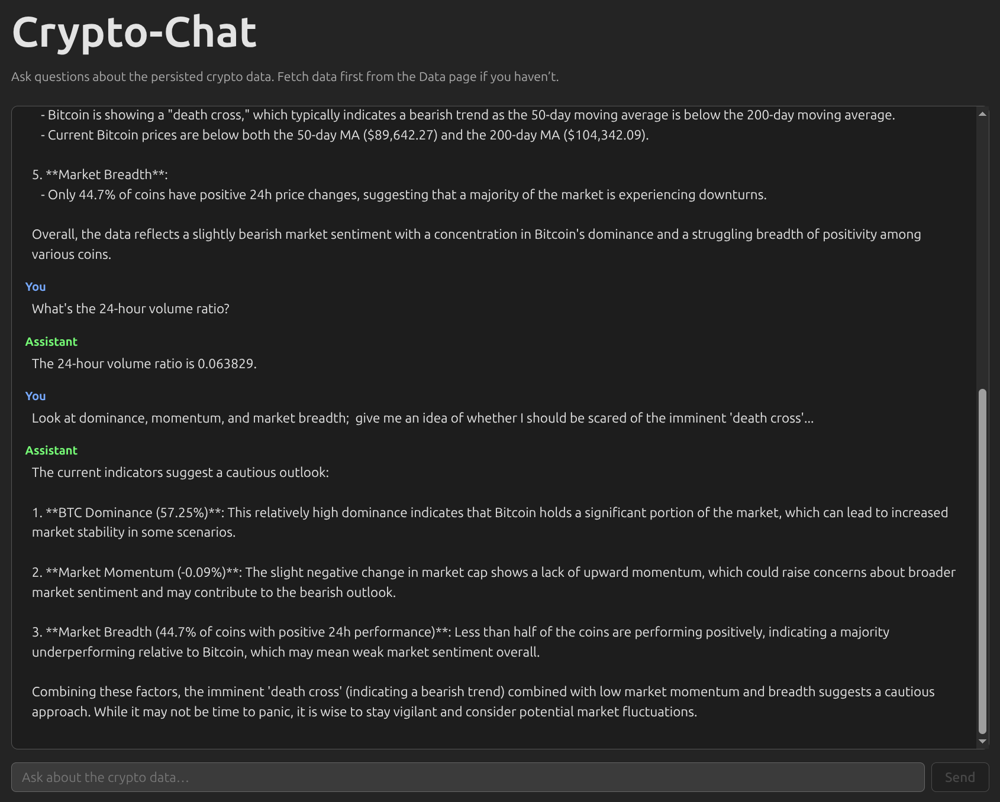

# 🚀 Conversational Crypto Dashboard (POC)

### A proof-of-concept demonstrating how to build an LLM-powered assistant informed by real-time cryptocurrency market data.

<p align="center"></p>

## What This POC Demonstrates

This application shows a simple architecture for building AI assistants that work with external data sources. Instead of letting the LLM make live API calls or hallucinate information, we:

1. **Fetch data on-demand** - A single button retrieves comprehensive market data. 

      - Currently from CoinGecko (global metrics, top 200 coins, Bitcoin historical prices)

2. **Compute derived insights** - A calculation layer transforms raw data into actionable metrics (moving averages, golden/death cross signals, market breadth, dominance ratios)
3. **Persist everything** - Both raw and derived data are stored, creating a consistent snapshot
4. **Inform the LLM** - The chat interface loads this persisted data and injects it as context. We want to  ensure every answer is grounded in actual market data

**The result: An AI crypto analyst that answers questions like "Is Bitcoin in a golden cross?" or "What's the current BTC dominance?" based on real data, not training knowledge.**

## Key Architecture Decisions

**Two Separate Flows:**
- **Fetch flow** - Button triggers data collection, calculation, and persistence (no LLM involved)
- **Chat flow** - Loads persisted data, passes it as context to the LLM, returns text responses

**Storage-First Design:**
The LLM never calls external APIs. All responses come from a single data snapshot stored in Vercel Blob/KV. This makes the system predictable, testable, and cost-effective.

**POC Scope:**
Text-only responses for initial launch. The architecture supports future enhancements (tables, charts, structured data) without requiring a rebuild.

## What You Can Ask

- Whatever you want; but the LLM is fed information that will give it particular insight into:
- Market overview questions ("What's the total crypto market cap?")
- Bitcoin-specific analysis ("Is BTC in a golden cross right now?")
- Comparative insights ("How are the top 10 coins performing vs the market?")
- Trend analysis ("What's the 24-hour volume ratio?")

All answers are based on the most recently fetched data snapshot.

## Tech Stack

- **Frontend:** React + Vite boilerplate, deployed on Vercel
- **Backend:** Vercel serverless functions (Node.js)
- **Data:** CoinGecko API (free layer)
- **LLM:** OpenAI (via AI SDK -  not free!)
- **Storage:** Vercel Blob;  maybe switch to KV later.
- **Testing:** Vitest

## Getting Started

1. Set environment variables: `OPENAI_API_KEY`, `BLOB_READ_WRITE_TOKEN` (see Local development below).
2. Run `npx vercel dev`, then open the app (e.g. http://localhost:3000).
3. Go to **Data** (`/cryptochat/data`) and click **Refresh data** to load and persist market data.
4. Go to **Chat** (`/cryptochat`) and ask questions (e.g. “What’s BTC dominance?”, “Is Bitcoin in a golden cross?”).


## Local development

You can run the app locally in two ways: frontend only (Vite) or frontend + API (Vercel dev).

### 1. Frontend only

From the project root:

```shell
npm run dev
```

Vite starts a dev server at **http://localhost:5173** (or the next free port). You get the React app with HMR. No API routes run because there is no `api/` folder yet. Use this when you only need the UI and no backend.

### 2. Frontend + API (full local)

To run the app like Vercel locally (Vite app + serverless API routes in `api/`), use the [Vercel CLI](https://vercel.com/download): `vercel dev` (or `npx vercel dev`). That starts a local server that serves the frontend and runs the API routes locally.

1. **Install the Vercel CLI** (project or global):

   ```shell
   npm i -D vercel
   ```

   Optionally add a script to `package.json`:

   ```json
   "dev:full": "vercel dev"
   ```

2. **Run local dev**:

   ```shell
   npx vercel dev
   ```

   Or, if you added the script:

   ```shell
   npm run dev:full
   ```

   This serves the Vite app and runs your `api/*` handlers. The URL is usually **http://localhost:3000** (Vercel dev default).

3. **Env vars** (for `OPENAI_API_KEY`, `BLOB_READ_WRITE_TOKEN`, etc.):

   ```shell
   npx vercel env pull .env.local
   ```

   That pulls your Vercel project env into `.env.local` so the API routes can use them locally. Add `.env.local` to `.gitignore` if it is not already there.

   **If you add or change `.env.local`:** restart `vercel dev` (stop it with Ctrl+C, then run `npx vercel dev` again) so the API process picks up the new variables. The API only runs when you use `vercel dev`—not when you use `npm run dev` (Vite only).

   **"OPENAI_API_KEY not configured" or "BLOB_READ_WRITE_TOKEN not set":** (1) Use `npx vercel dev` (not `npm run dev`) so the API runs. (2) Restart `vercel dev` after adding or editing the variable in `.env.local`. (3) Variable names must be exactly `OPENAI_API_KEY` and `BLOB_READ_WRITE_TOKEN`.

### Storage (Vercel Blob)

Crypto data (raw + derived) is stored in Vercel Blob. Create a Blob store in the Vercel project (Storage tab → Connect → Blob); that sets `BLOB_READ_WRITE_TOKEN`. Use `vercel env pull .env.local` so the API can read/write. The helper lives in `lib/storage.ts` (`write`, `read`, `deleteAll` for keys `global`, `topCoins`, `bitcoinChart`, `derived`).

Summary

Only React (current setup): npm run dev → http://localhost:5173
React + API (after adding api/): npx vercel dev (and optionally vercel env pull .env.local) → http://localhost:3000
